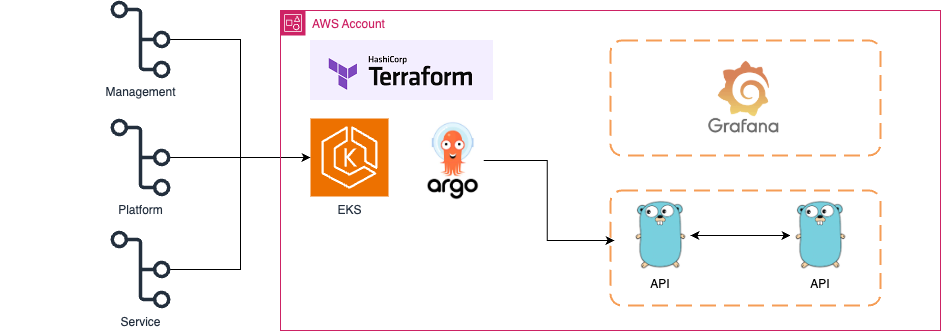

# k8s gitops pattern

## Architecture



```sh
    |- managements
        |- eks-cluster
        |- iam
        |- network
    |- platforms
        |- alb-ingress
        |- argocd
        |- argocd-rollout
        |- grafana
        |- loki
    |- services
        |- user-api
        |- payment-api
        |- mysql (statefulset)
```

## Todo

- [x] Managements 구성 (EKS, IAM, Network)
- [x] alb-ingress 구성
- [x] service-user 구성
- [x] service-payment 구성
- [x] argocd 구성
- [ ] argocd-rollout 구성
- [ ] couchbase 구성
- [ ] grafana 구성
- [ ] prometheus 구성
- [ ] loki / tempo / mimir 구성

## Configure

### eks 설정

```sh
aws eks update-kubeconfig \
    --name [eks name] \
    --region [region] \
    --profile [profile]
```

## Trouble Shooting

### aws-auth not found

```sh
kubectl get configmap aws-auth -n kube-system
```

### aws-auth issue

```sh
Get "http://localhost/api/v1/namespaces/kube-system/configmaps/aws-auth": dial tcp [::1]:80: connect: connection refused
```

- state 를 삭제하고 다시 apply

```sh
terraform state rm aws_eks_cluster.eks_cluster
terraform apply
```
