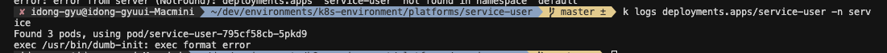

# ArgoCD GitOps

## Naming

```sh
    [namespace or common]-[service-name]
```

- common 일 경우, 내부에서 namespace 정의

## argocd 수정

```sh
sed -i '' 's/namespace: argocd/namespace: platform/g' install.yaml
sed -i '' 's/namespace: .*/namespace: platform/g' install.yaml

```

## argocd install

```sh
kubectl create namespace argocd
kubectl apply -n argocd -f https://raw.githubusercontent.com/argoproj/argo-cd/stable/manifests/install.yaml
```

## 이슈 모음

### CrashBackOff (exec format error)


- exec format error 
- github action 내 os 재구성

### CrashBackOff (Image Policy)

- ImagePolicy 내에서 IfNotPresent 일 경우, 이미지가 존재하지 않을 경우에만 이미지를 가져옴 (캐시는 좋으나, 문제가 있는 이미지를 계속 쓸 위험이 존재)
- Always를 사용하거나, Version을 바꿔줘야 함

### argocd 아무것도 안나옴 이슈 

- ERR_TOO_MANY_REDIRECTS (사용자 -> Ingress Controller(HTTPS) -> ArgoCD 서버(HTTP) -> HTTPS 리다이렉션 -> Ingress Controller -> ... (반복))
- ingress controller -> TLS를 자체적으로 종료하고 HTTP를 통해 백에드 서비스와 통신
- argocd-server -> 는 자체적으로 TLS를 종료하고 항상 HTTP 요청을 HTTPS 리다이렉션
- 둘이 결합하면서 ArgoCD 서버는 HTTPS로 무한 Redirection 발생

```sh
## alb-ingress (추가)
alb.ingress.kubernetes.io/backend-protocol: HTTPS
```

### argocd 초기 비밀번호

- donggyu-eks / argocd-initial-admin-secret

```sh
kubectl -n platform get secret argocd-initial-admin-secret -o jsonpath="{.data.password}" | base64 -d
```

### argocd 클러스터 연결문제 (RBAC 이슈)

```sh
failed to sync cluster https://172.20.0.1:443: failed to load initial state of resource Namespace: namespaces is forbidden: User "system:serviceaccount:platform:argocd-application-controller" cannot list resource "namespaces" in API group "" at the cluster scope
```

- rbac.yaml 추가